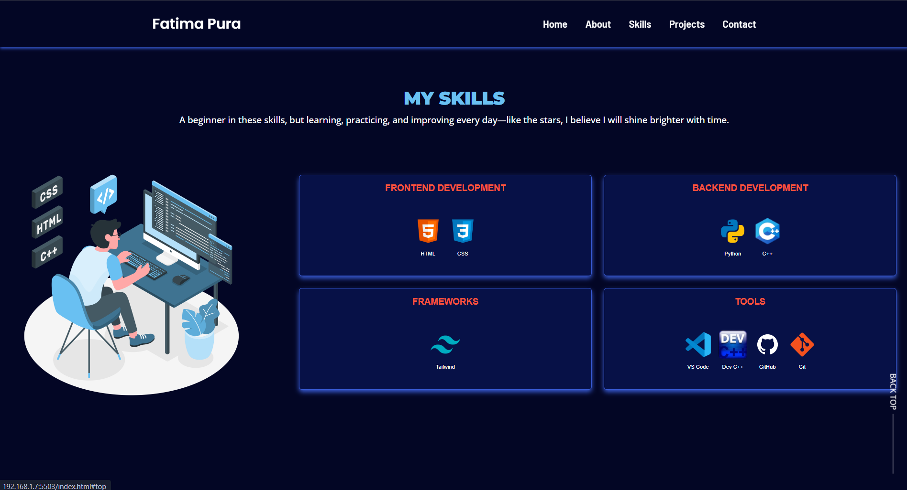

# FATIMA PURA'S PORTFOLIO

Welcome to my personal portfolio! This website showcases my personal information, skills, projects, and contact information. Below are the instructions to help you navigate through it.

---

## Table of Contents

### How to Navigate

1. [Home](#home)
2. [About](#about)
3. [Skills](#skills)
4. [Projects](#projects)
5. [Contact](#contact)

### PROGRAM DETAILS
1. [Features](#features)
2. [Dependencies](#dependencies)

---

## Home
The **Home** section introduces you to who I am. You’ll find my tagline, "YOUNG DREAMER, BUILDER OF POSSIBILITIES" and a brief introduction about myself as a first-year BS Computer Science student. If you'd like to know more about me, click the "About Me" button.

- Links to my social media (Facebook, Instagram, LinkedIn, GitHub) are also available for connection.

## About
The **About** section provides a more detailed description of me, including:
- A brief overview of my background and my current academic journey.
- My contact information.
- My completed projects.

## Skills
In the **Skills** section, you can explore the programming languages and technologies I am practicing and working with:
- **Frontend Development**: HTML, CSS, JavaScript
- **Backend Development**: Python, C++
- **Frameworks**: Tailwind, React
- **Tools**: VS Code, DevC++, GitHub, Git

## Projects
The **Projects** section showcases my notable projects. Each project has a description and a link to the GitHub repository:
1. **CompuCourse**: A C++-based course management system.
2. **Hangman Game**: A Python-based Hangman game with three difficulty levels.
3. **SpartanPortal**: A C++-based student management system.

Click on the GitHub icon to view the project code.

## Contact
The **Contact** section shows ways to connect with me. You can enter your name, email, and message. It also provides quick information about my location, email address, and phone number.

---

## Features

- **Interactive Design**: Includes responsive layouts and a modern user experience.
- **Accessible Links**: Direct access to my GitHub, LinkedIn, and social media.
- **Dynamic Content**: Includes contact forms for quick communication.

---

## Dependencies

The portfolio relies on the following technologies and libraries:

1. **HTML5**: Structure and layout of the web pages.
2. **CSS3**: Styling and responsive design (located in `assets/css/style.css`).
3. **JavaScript**: Interactive elements (script located in `assets/js/script.js`).
4. **Remix Icons**: For consistent and clean icons.
5. **Google Fonts**: Fonts such as Barlow, Open Sans, and Roboto.
6. **Ionicons**: Additional icon support.

All external resources are linked via CDN and do not require local installation.

